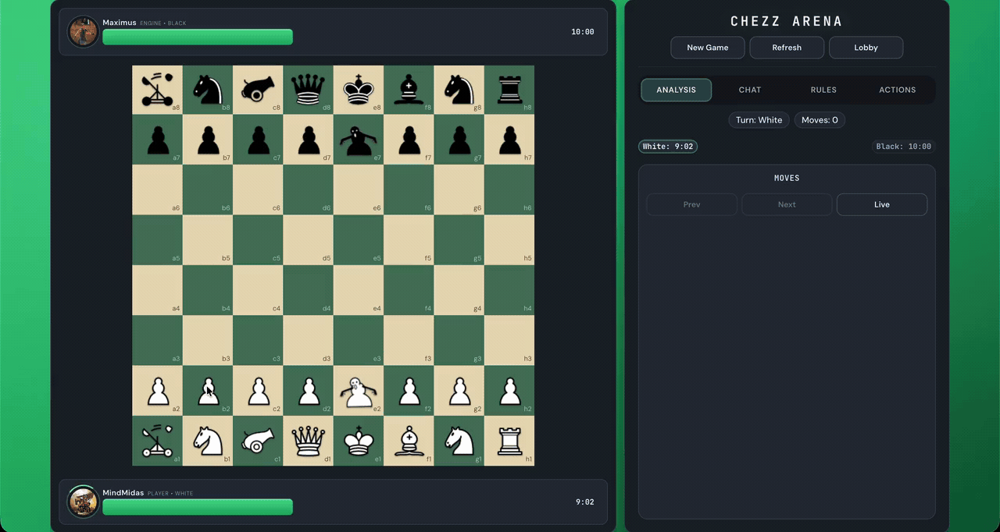

<h1 align="center">Chezz</h1>

<p align="center">
  
  
  
  
  
  
  
  
</p>

<p align="center">
  
</p>

---

# **Overview**

Chezz is a chess variant built into the Games Platform.

It was originally built for a competition, but the heuristics are still a work in progress.

The game uses a C engine for board generation and search. The Python runtime calls the engine, stores game state, and connects the result to the shared web app.

---

# **What Is Included**

- Custom chess rules with peons, zombies, cannons, and catapults.
- Bitboard board representation in C.
- Legal board generation for normal moves and special actions.
- Negamax search with alpha-beta pruning.
- Zobrist hashing and a transposition table.
- PvE and PvP support through the shared platform.

---

# **Rules**

The rules are close to chess, but there are a few important changes:

- The goal is to capture the enemy king.
- There is no check or checkmate logic.
- Peons promote to zombies.
- Zombies move one square orthogonally.
- Cannons can move or shoot.
- Catapults can move or fling another friendly piece.
- If both kings are removed by the same action, the game is a draw.

---

# **Pre-Requisites**

Run Chezz through the main `games` project.

Ensure the following are installed:

- Python 3.10+
- Node.js 20.19+, 22.13+, or 24+
- npm 10+
- C compiler and Make
- Supabase values in `.env`

---

# **Folder Structure**

```text
src/chezz/
|-- chezz.gif
|-- engine/
|   |-- include/
|   |-- src/
|   |-- debug/
|   `-- makefile
|-- runtime/
|   |-- API.md
|   |-- api.py
|   |-- engine.py
|   |-- game.py
|   `-- sessions.py
`-- README.md
```

---

# **How to Build & Run**

From the root of the `games` repo:

```bash
cp .env.example .env
```

Fill in the required values in `.env`.

Build the project:

```bash
./build build
```

Start the app:

```bash
./build
```

Open:

```text
http://127.0.0.1:8080
```

Then choose Chezz from the game menu.

---

# **How It Works**

The board is stored as bitboards. Each piece type has its own bitboard, and the engine also keeps combined masks for white pieces, black pieces, and all occupied squares.

Move generation creates complete next boards. A regular move, promotion, cannon shot, catapult fling, and zombie contagion all end up as generated board states.

The search starts from those generated boards. `negamax()` checks future positions, alpha-beta pruning cuts bad branches, and the transposition table reuses work when the same board appears again.

Basic flow:

```text
Chezzboard -> generated boards -> negamax -> evaluation -> best board
```

---

# **Core Files**

- `engine/include/chezz.h` - board model, pieces, and engine API.
- `engine/src/gen_valid_boards.c` - legal generated board creation.
- `engine/src/user_actions.c` - user moves, shots, and flings.
- `engine/src/negamax/` - search, evaluation, Zobrist hashing, and TT cache.
- `runtime/engine.py` - Python wrapper around the native engine.
- `runtime/API.md` - Chezz API documentation.

---

# **Notes**

- The C engine owns the game rules and search.
- The Python runtime owns sessions, API handling, and platform integration.
- Chezz supports PvE by default and PvP through the shared matchmaking flow.
