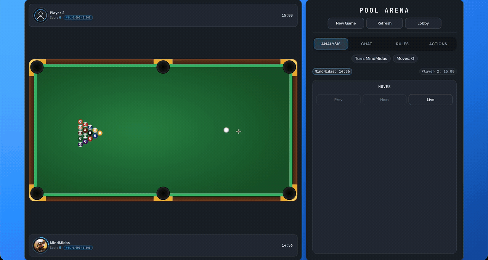

<h1 align="center">Pool</h1>

<p align="center">
  
  
  
  
  
  
  
  
</p>

<p align="center">
  
</p>

---

# **Overview**

Pool is the 8-ball game inside the MindMidas Games platform.

The physics engine is written in C. Python wraps the engine and turns each shot into replayable table states for the browser client.

---

# **What Is Included**

- 8-ball Pool with pass and play support.
- Online PvP through the shared platform.
- C physics engine for rolling, drag, cushions, pockets, and collisions.
- SWIG wrapper so Python can call the C engine.
- Shot history and replay state for the frontend.

---

# **Pre-Requisites**

Run Pool through the main `games` project.

Ensure the following are installed:

- Python 3.10+
- Node.js 20.19+, 22.13+, or 24+
- npm 10+
- C compiler and Make
- SWIG
- Supabase values in `.env`

---

# **Folder Structure**

```text
src/pool/
|-- pool.gif
|-- engine/
|   |-- phylib.c
|   |-- phylib.h
|   |-- phylib.i
|   `-- makefile
|-- runtime/
|   |-- API.md
|   |-- Physics.py
|   |-- api.py
|   |-- game.py
|   `-- sessions.py
`-- README.md
```

---

# **How to Build & Run**

From the root of the `games` repo:

```bash
cp .env.example .env
```

Fill in the required values in `.env`.

Build the project:

```bash
./build build
```

Start the app:

```bash
./build
```

Open:

```text
http://127.0.0.1:8080
```

Then choose Pool from the game menu.

---

# **How It Works**

A Pool shot is stored as a sequence of table states. The runtime gives the cue ball a starting velocity, then the C engine advances the table until the next important event happens.

Events include:

- a ball hitting a cushion
- a ball entering a pocket
- a rolling ball hitting a still ball
- two rolling balls colliding
- all balls stopping

The engine returns each new table state. The frontend uses those states to replay the shot.

Basic flow:

```text
cue velocity -> rolling ball -> segment simulation -> collision/rest -> next table state
```

---

# **Core Files**

- `engine/phylib.h` - table structs, object types, and constants.
- `engine/phylib.c` - physics, rolling motion, and collision handling.
- `engine/phylib.i` - SWIG interface for Python.
- `runtime/Physics.py` - Python wrapper for shot simulation.
- `runtime/API.md` - Pool API documentation.

---

# **Notes**

- Pool defaults to pass and play mode.
- The physics engine is event-based instead of frame-based.
- Generated table states are used for shot replay.
- Online PvP uses the shared matchmaking/session system.
